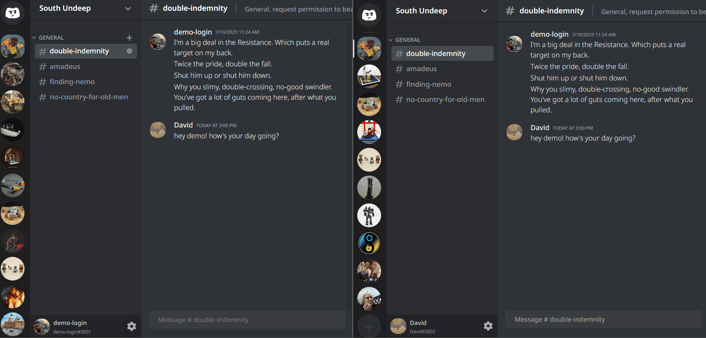

[](https://davescord.onrender.com/)


[](https://davescord.onrender.com/)

__Background__
----

Davescord is a clone of Discord, a communication platform in which users can build their own servers and channels to have organized discussions about any topic they are interested in. Users subscribed to the same server can chat in real time, and they recieve unread message notifications if they are not currently in the channel that the message was sent in.

__Technologies, Libraries, and APIs__
----
- Ruby on Rails Backend
- React and Redux Frontend
- PostgreSQL Database
- WebSockets via Action Cable
- AWS
- HTML
- CSS

__Key Features__
----

Using Davescord, users can:
- Create their own account and log in securely
- Create, read, update, and destroy their own servers as well as channels within their own servers
- Create, read, update, and destroy messages in servers they are subscribed to
- Create, read, and update their profile pictures and server images
- See changes to their subscribed servers in real time, including message posts, message edits, message deletion, and more.

__Code Snippets__
----

Here are some highlights of the code behind this website:

__Server Creation__

[](https://davescord.onrender.com/)

Any user who is logged in has the option to create their own server. The UI prevents users from creating a server with no name. Upon creation of the server, the user is automatically subscribed to the server and a default general channel is created so they can start sending messages immediately.

```
const handleServerCreation = async e => {
    e.preventDefault();

    if (newServerName.length > 0) {
        let server = {server_name: newServerName}

        // creates new server in the backend then adds it to the front end
        let newServer = await dispatch(createServer(server))

        // creates new channel in the backend then adds it to the front end
        let channel = {
            channel_name: "general",
            serverId: newServer.id,
            categoryName: "Text Channels",
            description: ""
        }
        let newChannel = await dispatch(createChannel(channel))
        dispatch(addChannel(newChannel))

        setNewServerName(defaultServerName.current);
        setVisible(false)

        // redirects user to the newly created channel
        history.push(`/channels/${newServer.id}/${newChannel.id}`)

        // restarts websockets
        setWebsocketRestart(!websocketRestart)
    }
}
```

__Channel Creation and Editing__

As the owner of a server, users will have the option either add a new channel to a server or edit any of the channels they have created within a server. The UI allows for quick access to channel edits on hover while the user is inside the server. While editing a channel, the interface will provide controls to save any changes once changes are detected.

```
<div className="channel-overview-menu">
    <h3>Overview</h3>
    <div>
        <div>
            <span className='channel-overview-input-title'>
                channel name
            </span>
            <form>
                <input className='channel-overview-input'
                        type='text'
                        value={channelName.replace(/\s+/g, '-').toLowerCase()}
                        onChange={e => setChannelName(e.target.value)}/>
            </form>

            <span className='channel-overview-input-title'>
                category
            </span>
            <form>
                <input className='channel-overview-input'
                        type='text'
                        value={category}
                        onChange={e => setCategory(e.target.value)}/>
            </form>

            <span className='channel-overview-input-title'>
                channel topic
            </span>
            <form>
                <input className='channel-overview-input'
                        type='text'
                        value={description}
                        onChange={e => setDescription(e.target.value)}/>
            </form>
        </div>
        <div className={((originalChannelName.current.replace(/\s+/g, '-').toLowerCase() !== channelName.replace(/\s+/g, '-').toLowerCase() ||
                            originalChannelCategory.current !== category ||
                            originalChannelTopicName.current !== description)
                            && channelName.length > 0 && category.length > 0)
                ? 'save-button-holder' : 'save-button-holder hidden'}>
            <div className="save-button-text">
                Careful - you have unsaved changes!</div>
            <div className="buttons">
                <button className='channel-overview-reset-button' onClick={e => resetFields()}>Reset</button>
                <button className='channel-overview-save-button' onClick={changeChannel}>Save Changes</button>
            </div>
        </div>
    </div>
</div>
```

__Live Communication__

[](https://davescord.onrender.com/)

When a user first logs in, a component is mounted on the frontend which creates WebSocket subscriptions to every channel in every server they are subscribed to as well as WebSocket subscriptions to the servers themselves. Each of these subscriptions listen for changes to the backend state and respond by updating the frontend state for all users who are listening to the corresponding WebSocket subscription. These subscriptions are created in a React useEffect which has proper cleanup of all the WebSocket subscriptions as well as a way to restart all of the subscriptions.

```
useEffect(() => {
    let allSubscriptions = [];

    subscribedServers?.forEach(server => {
        server.channels?.forEach(channelId => {
                const subscription = consumer.subscriptions.create(
                    { channel: 'ChannelsChannel', id: channelId },
                    { received: ({type, message, messageId, channelId, serverId}) => {
                            switch (type) {
                                case RECEIVE_MESSAGE:
                                    dispatch(setUnreadChannel(channelId));
                                    dispatch(setUnreadServer(serverId));
                                    dispatch(addMessage(message, channelId));
                                    break;
                                case DESTROY_MESSAGE:
                                    dispatch(removeMessage(messageId, channelId))
                                    break;
                                default:
                                    break;
                            }
                        }
                    }
                )
                allSubscriptions.push(subscription)
            }
        )

        const subscription = consumer.subscriptions.create(
            { channel: 'ServersChannel', id: server.id },
            { received: ({type, channel, channelId, serverId}) => {
                    switch (type) {
                        case RECEIVE_CHANNEL:
                            dispatch(addChannel(channel))
                            setWebsocketRestart(!websocketRestart) // force reset websockets
                            break;
                        case DESTROY_CHANNEL:
                            dispatch(removeChannel(channelId))
                            break;
                        case RECEIVE_SERVER:
                            setWebsocketRestart(!websocketRestart) // force reset websockets
                            break;
                        case UPDATE_SERVER:
                            dispatch(fetchServer(serverId))
                            break
                        case DESTROY_SERVER:
                            dispatch(removeServer(serverId))
                            break
                        default:
                            break;
                    }
                }
            }
        )
        allSubscriptions.push(subscription)
    })

    return () => {
        allSubscriptions.forEach(subscription => {
            subscription?.unsubscribe();
        })
    }
}, [websocketRestart])
```

__Future Plans:__
----
The work for this project is not yet complete. In the near future, I plan to implement the following features:
- A friend request system as well as the ability to send private messages to other users
- A robust server invite system which allows server subscribers to create invitation links which have expiration dates
- WebSocket integration of user statuses so users can see if their friends are online
- Video chatting with friends using WebRTC
